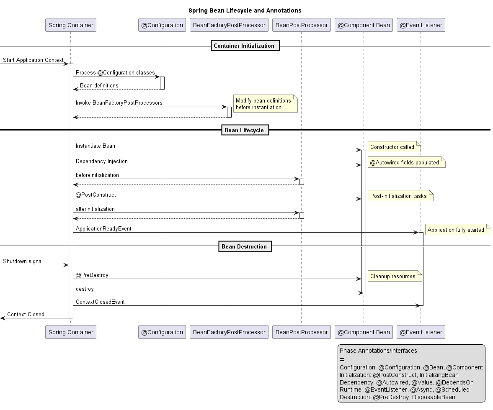

# Spring Boot Lifecycle and Annotations Guide

This project demonstrates the Spring Boot bean lifecycle and various annotations used for managing beans, dependencies, and application flow.

## Table of Contents
1. [Bean Lifecycle Overview](#bean-lifecycle-overview)
2. [Key Annotations](#key-annotations)
3. [Examples](#examples)
4. [Running the Application](#running-the-application)
5. [Testing](#testing)

## Bean Lifecycle Overview

The Spring bean lifecycle consists of several phases, as shown in the diagram below:



### Lifecycle Phases

1. **Container Initialization**
   - Spring container starts
   - @Configuration classes are processed
   - BeanFactoryPostProcessors modify bean definitions

2. **Bean Instantiation**
   - Constructor injection
   - @Autowired field injection
   - Property values set

3. **Bean Initialization**
   - BeanPostProcessor.beforeInitialization()
   - @PostConstruct methods
   - InitializingBean.afterPropertiesSet()
   - Custom init methods
   - BeanPostProcessor.afterInitialization()

4. **Bean Usage**
   - Bean is ready for use
   - ApplicationContext is fully started
   - @EventListener methods are registered

5. **Bean Destruction**
   - @PreDestroy methods
   - DisposableBean.destroy()
   - Custom destroy methods

## Key Annotations

### Configuration Annotations
- `@Configuration`: Marks a class as a source of bean definitions
- `@Component`: Marks a class as a Spring-managed component
- `@Bean`: Declares a method as a bean producer
- `@Scope`: Defines bean scope (singleton, prototype, etc.)

### Lifecycle Annotations
- `@PostConstruct`: Method to execute after bean initialization
- `@PreDestroy`: Method to execute before bean destruction
- `@DependsOn`: Specifies bean initialization order

### Dependency Injection
- `@Autowired`: Injects dependencies automatically
- `@Value`: Injects values from properties
- `@Qualifier`: Specifies which bean to inject

### Conditional Annotations
- `@Profile`: Activates beans based on profiles
- `@Conditional`: Custom conditions for bean creation
- `@ConditionalOnProperty`: Property-based conditions

### Event Handling
- `@EventListener`: Marks methods as event listeners
- `@Async`: Executes methods asynchronously
- `@Scheduled`: Schedules method execution

## Examples

### Basic Component with Lifecycle Methods
```java
@Component
public class LifecycleBean {
    private final Logger logger = LoggerFactory.getLogger(LifecycleBean.class);
    
    @PostConstruct
    public void init() {
        logger.info("Bean initialized");
    }
    
    @PreDestroy
    public void cleanup() {
        logger.info("Bean being destroyed");
    }
}
```

### Configuration Class Example
```java
@Configuration
public class AppConfig {
    @Bean
    @DependsOn("dependencyBean")
    public MyService myService() {
        return new MyServiceImpl();
    }
    
    @Bean
    public DependencyBean dependencyBean() {
        return new DependencyBean();
    }
}
```

### Event Listener Example
```java
@Component
public class EventHandlerBean {
    @EventListener
    public void handleContextStarted(ContextStartedEvent event) {
        // Handle context started event
    }
    
    @EventListener
    public void handleCustomEvent(CustomEvent event) {
        // Handle custom event
    }
}
```

### Profile-Specific Bean
```java
@Component
@Profile("dev")
public class DevDataSource implements DataSource {
    // Development-specific implementation
}

@Component
@Profile("prod")
public class ProdDataSource implements DataSource {
    // Production-specific implementation
}
```

## Running the Application

1. Clone the repository
2. Build the project:
   ```bash
   ./mvnw clean install
   ```
3. Run the application:
   ```bash
   ./mvnw spring-boot:run
   ```

## Testing

The project includes comprehensive tests demonstrating bean lifecycle and annotations:

```java
@SpringBootTest
class LifecycleBeanTest {
    @Autowired
    private LifecycleBean lifecycleBean;
    
    @Test
    void contextLoads() {
        assertThat(lifecycleBean).isNotNull();
    }
}
```

Run tests using:
```bash
./mvnw test
```

## Additional Resources

- [Spring Framework Documentation](https://docs.spring.io/spring-framework/reference/core.html)
- [Spring Boot Reference](https://docs.spring.io/spring-boot/docs/current/reference/html/)
- [Bean Lifecycle Blog Post](https://www.baeldung.com/spring-bean-lifecycle)
